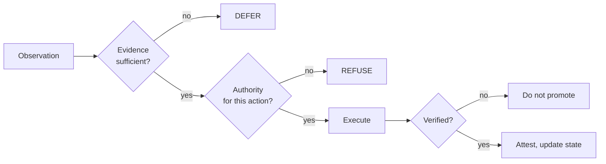

# Eunoia

<!-- 30s-demo -->
> **Status labels.** **SPECIFICATION / PROPOSAL:** almost all of this repository (architecture, protocols,
> the consciousness module, the geometry protocol). **PROTOTYPE:** two small SWAY helpers and the checks
> below. **NOT PRODUCTION-READY:** all of it. Nothing here is autonomous or runs a model.

**Headline (measured):** there is no empirical result in this repository yet, and it says so. What is
measured is that its own guards can fail: on 2026-09-30 the SWAY state schema accepted 3 of 4 "settled
without evidence" mutants. It now rejects all 4. The exact-threshold helper had returned the wrong answer
for `0.3 − 0.1 ≥ 0.2`; floats are now refused. See [STATUS.md](STATUS.md).

### 30-second demo: PROTOTYPE

```bash
git clone https://github.com/holland202/eunoia && cd eunoia
pip install pytest jsonschema && python -m pytest -q && python research/sway/implementation/exact_threshold.py
```

Output (x86_64, Python 3.11, 2026-09-30):

```
...............                                                          [100%]
15 passed in 0.12s
float: 0.050000000000000044 <= 0.05 -> False
exact: 1/20 inclusive -> True
```

The last two lines are the C006b bug in one line each: in floats, a change of exactly 0.05 fails a
"≤ 0.05" bound; in exact arithmetic it passes.



### Why this is not just sovereign-veritas again

sovereign-veritas is the implemented gate over records. This repository is the architecture *around* it:
the claim vocabulary, the authority model, and the research protocols. It is mostly specification, and
it is labelled that way. Where it overlaps with the gate, the gate's measured limits apply: CONSISTENT is
not TRUE.
<!-- /30s-demo -->


**εὔνοια** — good will, beautiful thinking, benevolent disposition.

**Technical interpretation:**

> Eunoia is an evidence-bounded architecture for autonomous intelligence in which reasoning, action, learning, and adaptation remain constrained by explicit authority, provenance, uncertainty, verification, and resource limits.

---

## What Eunoia is

An architecture and research program for investigating how increasingly capable local/autonomous intelligence can operate while maintaining explicit distinctions between observation, inference, hypothesis, evidence, authority, action, outcome, verification, and recorded knowledge.

Eunoia is a **research instrument first**, autonomous intelligence system second.

## What Eunoia is not

- **Not AGI.**
- **Not a chatbot.**
- **Not a claim of sentience.**
- **Not a safety guarantee.**
- **Not a solution to alignment.**
- **Not a replacement for empirical validation.**
- **Not cloud-dependent by design.**

## Core principle

```
Intelligence does not automatically confer authority.
```

### Preserved distinctions

```
PROPOSAL          ≠  AUTHORITY
OBSERVATION       ≠  PROOF
INFERENCE         ≠  FACT
ADMISSIBLE        ≠  SUFFICIENT EVIDENCE
AUTHORIZED        ≠  EXECUTED
EXECUTED          ≠  VERIFIED
NOT_SUPPORTED     ≠  REFUTED
UNKNOWN           ≠  FALSE
```

## Founding principle (from SWAY self-application)

> Detection creates evidence. It does not create authority.

## Core control loop

```
OBSERVE → INTERPRET → HYPOTHESIZE → PLAN
  → CHECK EVIDENCE → CHECK AUTHORITY
  → CHECK CONSTRAINTS → CHECK RESOURCES
  → PROPOSE ACTION → VERIFY AUTHORIZATION
  → EXECUTE → OBSERVE OUTCOME
  → VERIFY → ATTEST → UPDATE STATE
```

Failure paths: INSUFFICIENT EVIDENCE → DEFER | UNAUTHORIZED → REFUSE | UNSAFE → CONTAIN | FAILED VERIFICATION → DO NOT PROMOTE

## Research streams

| Stream | Role | Status |
|--------|------|--------|
| Sovereign Veritas | Evidence/governance substrate | Existing implementation/research |
| SWAY | Scientific method | Adopted (Amendment 1); not validated; O1 OPEN; P5 UNRUN |
| DECAY | Subtractive reasoning | Frozen specification |
| GROWTH | Constructive dual | Frozen specification |
| Companion | Cheap-probe efficiency | Experimental |
| Topology | Structural invariance | Experimental |
| Geometry–consciousness | Representational geometry vs substrate | Research package |
| Information geometry | Research/hypothesis | No established results here |
| Constitutional geometry | Typed authority | Experimental; certificates object-bound |

See [STATUS.md](STATUS.md).

## Next executable target: v0.01 substrate

A deliberately small set of contracts that make the observation → evidence → claim → verification → authorization → decision chain explicit and inspectable. Skeleton package layout lives under `src/eunoia/`. Full design notes: [docs/DESIGN_NOTES.md](docs/DESIGN_NOTES.md). Consolidation and migration rules: [docs/migration/](docs/migration/).

## Epistemic policy (summary)

Every claim must carry an identifiable epistemic status: FACT · MEASURED · DERIVED · IMPLEMENTED · HYPOTHESIS · PROPOSAL · SPECULATIVE · UNKNOWN · REFUTED

Full policy: [EPISTEMIC_POLICY.md](EPISTEMIC_POLICY.md)

## Version

**Eunoia v0.1 — Foundational Architecture** (v0.01 substrate planned)

No scientific claim is promoted beyond its documented evidence status.

---

*Capability does not imply authority.*
